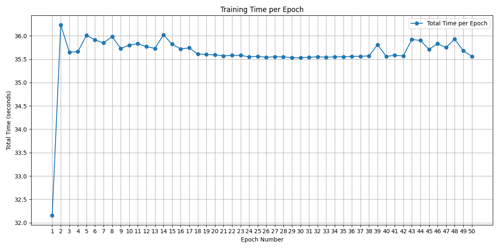
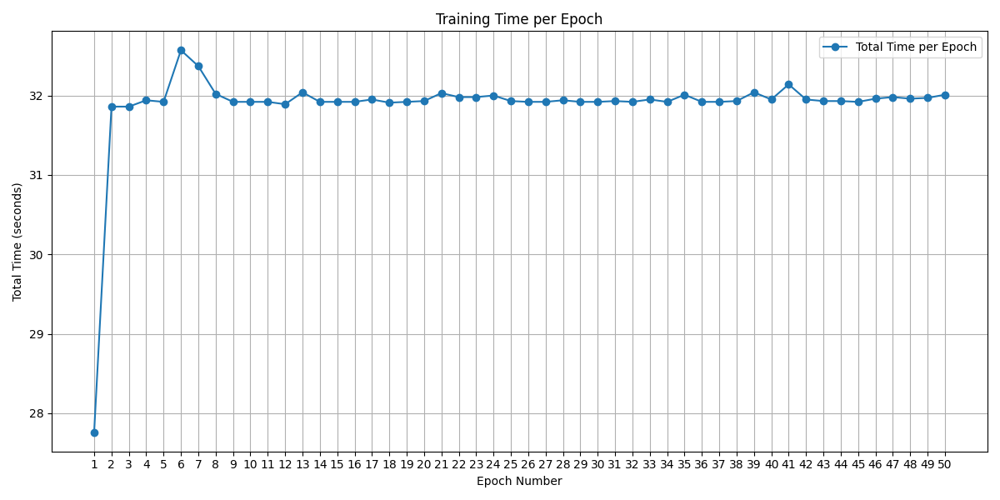
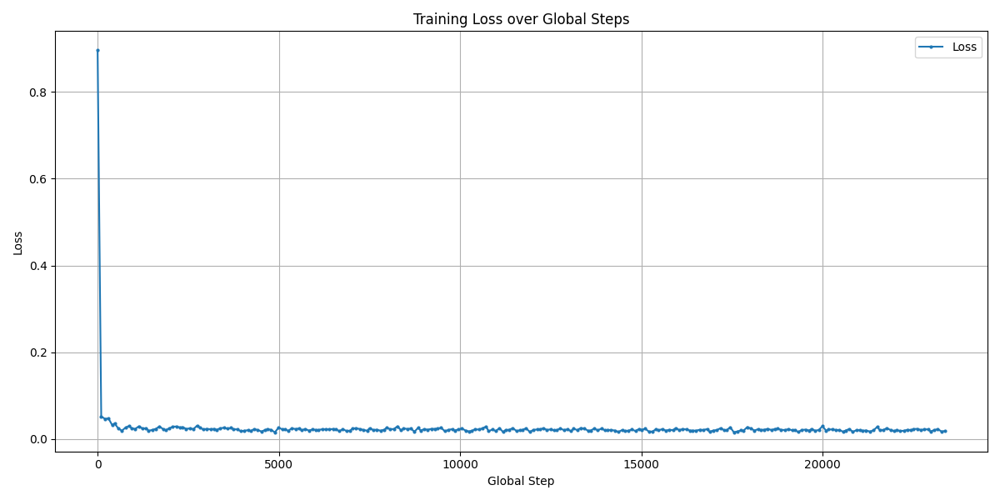

# CFG_jittor

## Introduction
This work is the implementation of Condition-Free Guidance(CFG) with Jittor frame(https://github.com/Jittor/jittor).

- Training and sampling with MNIST dataset
- Training and testing process aligned with PyTorch implementation
- Include evaluation metrics suach as training logs, loss vs.step figure, time vs. epoch figure.
- Evaluate the generated image in gFID and Inception Score(IS)
- Due to the high complexity, we implement the EVALUATION with Pytorch frame only.(Waiting to be changed)

## 1. Create a jittor environment
### create the enviroment and install jittor package
```bash
conda create -n jit python=3.10
conda activate jit 

pip install jittor imageio scipy tqdm numpy matplotlib

# test whether jittor is already to be used
python -n jittor.test.test_score
python -m jittor.test.test_example
python -m jittor.test.test_cudnn_op
```

## 2. Downloading the projection and move the necessity to \dataset
```bash
git clone
cd CFG_Jittor
mkdir dataset
mv mnist_train ./dataset
```

## 3. Train your own  model
```bash
python main.py
```
The weight can be saved to ./saved_models. 

The torch weight is .pth and jittor weight is .pkl

You can change the hyperparameters in main.py like epoch and p_uncond in CFG.

## Performance evaluation
### 1. Time consuming(We train the whole model with a single NVIDIA 4090 GPU)
Jittor time consuming:

Torch time consuming:


The time consuming of Jittor is a little bit bigger than Pytorch. 

### 2. Training loss
Jittor:

Torch:


### 3. Training logs
We provide the experimental logs in projection.

### 4. Evaluation score(FID and IS)
Jittor: FID: 50.61, IS: 2.00 (std: 0.30)
Torch:  FID: 51.36, IS: 1.88 (std: 0.35)

### Generation images
Jittor:


Pytorch:


